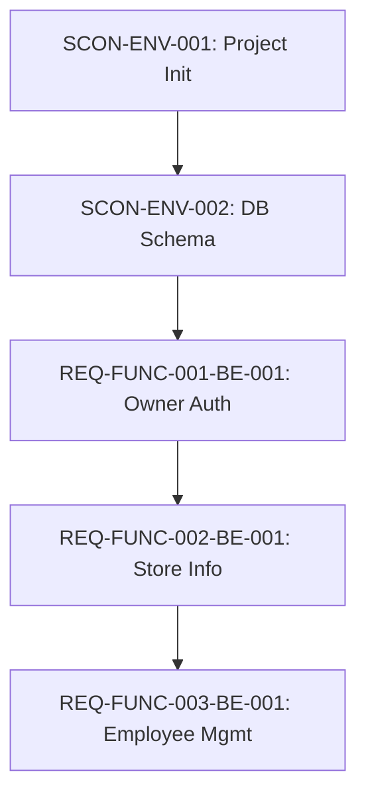
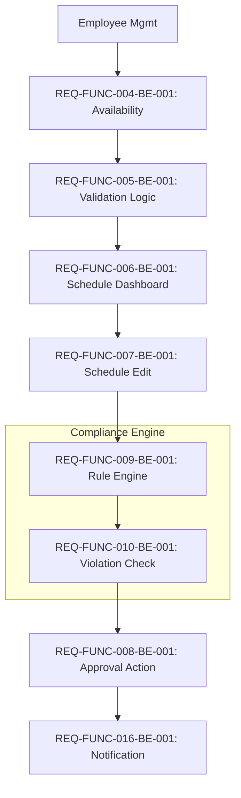
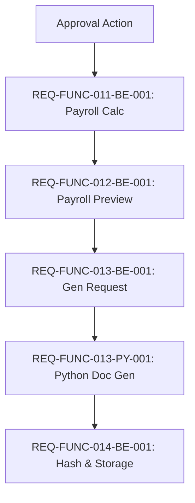

# Integrated Task Tree (WBS) & Dependency Graph (DAG)

## 1. Work Breakdown Structure (WBS)

### **EPIC 0: Project Initialization (Foundation)**
- **Feature: Environment & Base Architecture**
  - `SCON-ENV-001`: Spring Boot 3.x 프로젝트 스캐폴딩 및 패키지 구조 설정
  - `SCON-ENV-002`: MySQL DB 스키마 설계 (Store, Employee, Schedule 등) 및 연동
  - `SCON-ENV-003`: Global Exception Handler 및 공통 Response 포맷(ApiResponse) 구현

### **EPIC 1: Onboarding & Store Management (Start)**
- **Feature: Store & Owner Onboarding (REQ-FUNC-001, 002)**
  - `REQ-FUNC-001-BE-001`: 사장님 회원가입 및 인증(JWT) API
  - `REQ-FUNC-002-BE-001`: 매장 정보(업종, 영업시간 등) 설정 및 조회 API
- **Feature: Employee Management (REQ-FUNC-003)**
  - `REQ-FUNC-003-BE-001`: 직원 등록(계약유형, 시급 포함) 및 목록 조회 API

### **EPIC 2: Employee Availability (Input)**
- **Feature: Availability Submission (REQ-FUNC-004, 005, 018)**
  - `REQ-FUNC-004-BE-001`: 직원 가용시간 제출(토큰 기반 Public 접근) API
  - `REQ-FUNC-005-BE-001`: 가용시간 중복/누락 검증 로직 및 에러 처리
  - `REQ-FUNC-018-BE-001`: 입력 오류 감지 시 승인 프로세스 차단 로직

### **EPIC 3: Schedule Management (Core Workflow)**
- **Feature: Schedule Dashboard & CRUD (REQ-FUNC-006, 007)**
  - `REQ-FUNC-006-BE-001`: 승인 대기(3단계 카드) 상태 조회 API
  - `REQ-FUNC-007-BE-001`: 스케줄 드래그&드롭 수정(Draft 버전 관리) API
- **Feature: Compliance Engine Integration (REQ-FUNC-009, 010)**
  - `REQ-FUNC-009-BE-001`: 노동법 규칙 엔진(ComplianceService) 핵심 로직 구현
  - `REQ-FUNC-010-BE-001`: 승인 시도 시 위반 사항 감지 및 차단(Block) 로직
- **Feature: Approval & Notification (REQ-FUNC-008, 016, 017)**
  - `REQ-FUNC-008-BE-001`: 스케줄 확정(Approval) 및 상태 전이 처리
  - `REQ-FUNC-016-BE-001`: 스케줄 확정 시 직원 알림(Kakao/SMS) 발송 연동

### **EPIC 4: Payroll & Documentation (Output)**
- **Feature: Payroll Calculation (REQ-FUNC-011, 012)**
  - `REQ-FUNC-011-BE-001`: 급여/수당(주휴, 연장, 야간 등) 자동 계산 로직
  - `REQ-FUNC-012-BE-001`: 급여 미리보기 및 변동 사항 하이라이트 데이터 제공
- **Feature: Evidence Generation (REQ-FUNC-013, 014)**
  - `REQ-FUNC-013-PY-001`: [Python] PDF/Excel 증빙 생성 Microservice 구현
  - `REQ-FUNC-013-BE-001`: [Spring] 증빙 생성 요청 및 결과 처리 오케스트레이션
  - `REQ-FUNC-014-BE-001`: 증빙 파일 Hash 생성 및 위변조 방지 저장 로직

### **EPIC 5: Non-Functional & Operations**
- **Feature: Reliability & Security**
  - `REQ-NF-006-SEC-001`: PII(개인정보) 필드 AES-256 암호화 적용
  - `REQ-NF-015-BE-001`: 대량 트래픽 대응을 위한 캐싱 및 쿼리 최적화
  - `REQ-FUNC-015-BE-001`: Audit Log(감사 로그) AOP 기반 자동 기록 구현

---

## 2. Dependency Graph (DAG)

### **Flow 1: Project Setup & Core Data**

### **Flow 2: Main Business Logic (Schedule & Compliance)**

### **Flow 3: Payroll & Documentation Pipeline**

### **Execution Strategy**
1. **Phase 1 (Foundation)**: `SCON-ENV` 및 `EPIC 1`(매장/직원)을 먼저 완료하여 데이터 구조를 잡습니다.
2. **Phase 2 (Core Logic)**: `EPIC 2`(가용시간)와 `EPIC 3`(스케줄)를 진행하되, **Compliance Engine(규칙 엔진)** 을 우선 구현하여 스케줄 로직에 반영합니다.
3. **Phase 3 (Integration)**: 스케줄 승인이 완료된 데이터로 `EPIC 4`(급여/증빙) 파이프라인을 연결합니다. Python 마이크로서비스는 이 시점에 연동합니다.
4. **Phase 4 (Hardening)**: `Audit Log`, `Security` 등 비기능 요구사항을 적용하고 부하 테스트를 수행합니다.

