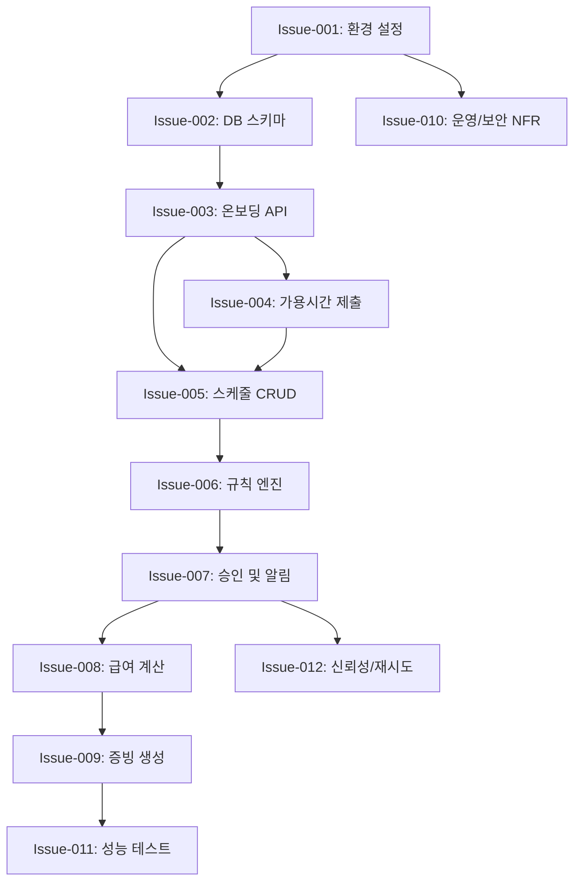

# 이슈 실행 계획 및 의존성 그래프 (Issue Execution Plan)

이 문서는 SCON WBS를 기반으로 생성된 GitHub Issue들의 권장 실행 순서를 설명합니다.
작업 간의 의존성과 병렬 개발 가능 여부를 포함합니다.

## 1. 실행 흐름 (순차적)

주요 경로(Critical Path)는 환경 설정, 핵심 데이터 모델 구현, 스케줄 워크플로우 구축, 그리고 마지막으로 급여 엔진 구현으로 이어집니다.

### Phase 1: 기반 구축 (Foundation) - 필수 선행
1. **[Issue-001] 프로젝트 초기화 및 개발 환경 구성**
   - *모든 작업의 선행 조건.*
2. **[Issue-002] 데이터베이스 스키마 설계 및 설정**
   - *Issue-001에 의존.*
3. **[Issue-003] 온보딩 및 매장/직원 관리 API 구현**
   - *Issue-002에 의존.*

### Phase 2: 핵심 기능 (Core Features) - 부분 병렬 가능
4. **[Issue-004] 직원 가용시간 제출 API 및 검증 로직**
   - *Issue-003(직원 엔터티)에 의존.*
5. **[Issue-005] 스케줄 대시보드 및 편집 API 구현**
   - *Issue-003(매장/직원)에 의존.*
   - *Issue-004와 병렬 진행 가능.*
6. **[Issue-006] 노동법 규칙 엔진 핵심 로직 구현**
   - *단위 로직은 독립 개발 가능하나, 통합은 Issue-005 필요.*

### Phase 3: 워크플로우 및 산출물 (Workflow & Outputs)
7. **[Issue-007] 스케줄 승인 및 알림 발송 구현**
   - *Issue-005(스케줄) 및 Issue-006(규칙 엔진)에 의존.*
8. **[Issue-008] 급여 계산 엔진 구현**
   - *Issue-007(승인된 스케줄)에 의존.*
9. **[Issue-009] 증빙 문서 생성 및 관리 구현**
   - *Issue-008(급여 데이터)에 의존.*

### Phase 4: 시스템 강화 (Hardening)
10. **[Issue-010] 비기능 요구사항: 운영 및 보안 설정**
    - *지속적으로 적용 가능하나, 전체 범위 검증은 이 단계에서 수행.*
11. **[Issue-011] 핵심 기능 성능 최적화 및 부하 테스트**
    - *주요 기능 구현 완료 후 수행.*
12. **[Issue-012] 시스템 신뢰성 및 재시도 메커니즘 구현**
    - *Issue-007(알림), Issue-006(규칙) 등과 연계.*

---

## 2. 병렬 실행 시나리오 (Parallel Execution)

여러 개발자 또는 에이전트가 가용할 경우 다음과 같이 병렬로 작업을 수행할 수 있습니다.

### 시나리오 A: 개발자 2인
- **Dev 1 (워크플로우 담당)**: Issue-003 -> Issue-005 -> Issue-007 -> Issue-012
- **Dev 2 (엔진/입력 담당)**: Issue-004 -> Issue-006 -> Issue-008 -> Issue-011

### 시나리오 B: 개발자 3인
- **Dev 1 (코어 API)**: Issue-003 -> Issue-005 -> Issue-007
- **Dev 2 (로직 엔진)**: Issue-006 -> Issue-008
- **Dev 3 (연동/통합)**: Issue-004 -> Issue-009 -> Issue-010 -> Issue-012

---

## 3. 의존성 그래프 (Dependency Graph)

