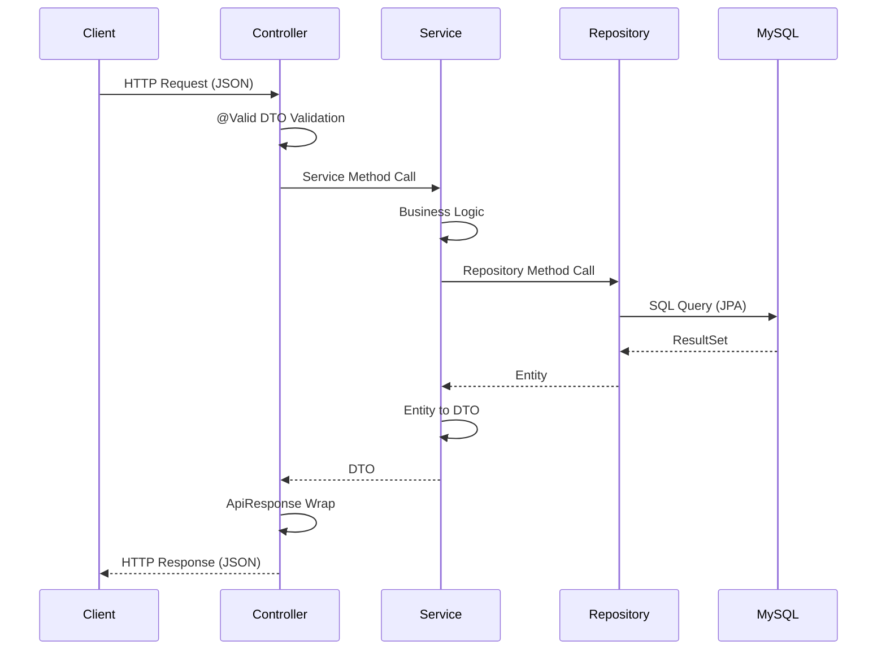
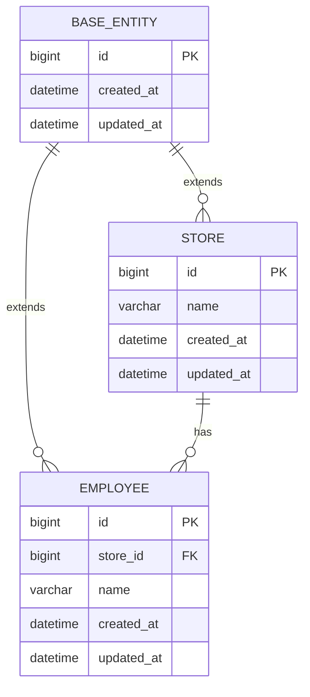
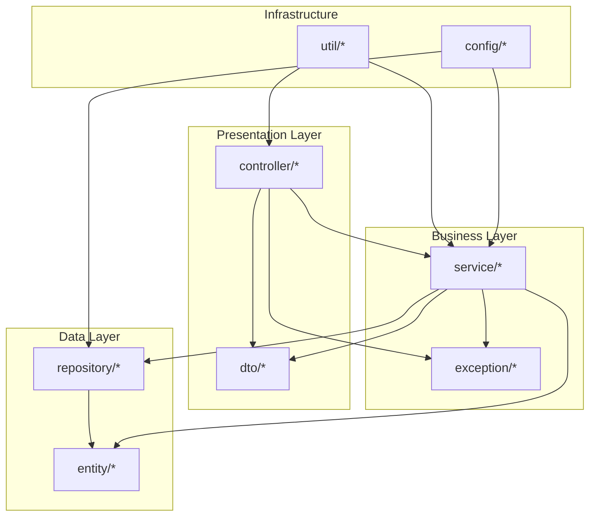
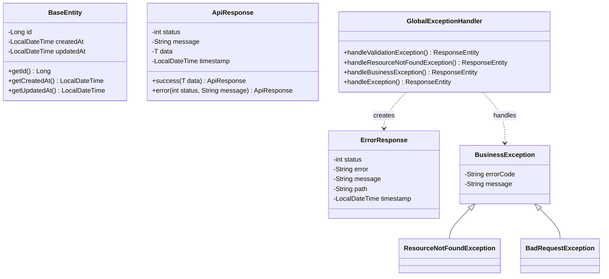

## 1. 목적
Spring Boot 3.x 프로젝트 구조를 초기화하고 개발을 위한 기본 환경을 구성한다.

## 2. 범위
- Spring Boot 3.x 기반의 Gradle 프로젝트 설정.
- 패키지 구조 정의 (`vibe.scon.scon_backend`).
- `application.properties` (또는 `.yml`) 프로파일 설정 (dev, prod).
- 전역 예외 처리기(Global Exception Handler) 및 공통 응답(ApiResponse) 래퍼 구현.

## 3. 상세 작업

### 3.1 프로젝트 기본 설정
- [x] Spring Boot 프로젝트 생성 (Java 21, Gradle)
- [x] `.gitignore` 설정
- [x] `README.md` 작성

### 3.2 의존성 추가 (`build.gradle`)
- [x] `spring-boot-starter-web` 추가 (REST API 개발용)
- [x] `spring-boot-starter-validation` 추가 (Jakarta Bean Validation)
- [x] `lombok` 추가 및 annotationProcessor 설정

### 3.3 패키지 구조 생성
- [x] `vibe.scon.scon_backend.config` 패키지 생성
- [x] `vibe.scon.scon_backend.controller` 패키지 생성
- [x] `vibe.scon.scon_backend.service` 패키지 생성
- [x] `vibe.scon.scon_backend.repository` 패키지 생성
- [x] `vibe.scon.scon_backend.entity` 패키지 생성
- [x] `vibe.scon.scon_backend.dto` 패키지 생성
- [x] `vibe.scon.scon_backend.exception` 패키지 생성
- [x] `vibe.scon.scon_backend.util` 패키지 생성

### 3.4 프로파일 설정
- [x] `application.yml` 기본 설정 (공통)
- [x] `application-dev.yml` 개발 환경 설정
- [x] `application-prod.yml` 운영 환경 설정

### 3.5 공통 응답 및 예외 처리
- [x] `ApiResponse<T>` 표준 응답 래퍼 클래스 정의
  - 필드: `status`, `message`, `data`, `timestamp`
- [x] `ErrorResponse` 오류 응답 클래스 정의
- [x] `GlobalExceptionHandler` 구현 (`@RestControllerAdvice`)
  - `MethodArgumentNotValidException` 처리 (400)
  - `ResourceNotFoundException` 처리 (404)
  - `BusinessException` 처리 (비즈니스 로직 오류)
  - 일반 `Exception` 처리 (500)
- [x] 커스텀 예외 클래스 정의
  - `ResourceNotFoundException`
  - `BadRequestException`
  - `BusinessException`

### 3.6 Health Check API
- [x] `/api/v1/health` 엔드포인트 구현 (서버 상태 확인용)

## 4. 완료 조건 (Acceptance Criteria)
- [x] `./gradlew build` 명령어로 프로젝트가 성공적으로 빌드되어야 한다.
- [x] API 호출 시 성공/실패 응답이 표준 JSON 포맷으로 반환되어야 한다.
- [x] `/api/v1/health` 호출 시 `ApiResponse` 형식의 응답이 반환되어야 한다.
- [x] 잘못된 요청 시 `ErrorResponse` 형식으로 에러가 반환되어야 한다.

## 5. 기술 스택
- **Java**: 21 (LTS)
- **Spring Boot**: 3.3.5
- **Build Tool**: Gradle
- **Package**: `vibe.scon.scon_backend`

---

## 6. 아키텍처 설계

### 6.1 3-Tier 아키텍처 개요

본 프로젝트는 **Controller → Service → Repository** 순서의 3-Tier 레이어드 아키텍처를 적용한다.
구현 순서는 데이터 계층부터 시작하여 **Repository → Service → Controller** 순서로 진행한다.

```
┌─────────────────────────────────────────────────────────────────┐
│                        Client (HTTP)                            │
└─────────────────────────────────────────────────────────────────┘
                              │
                              ▼
┌─────────────────────────────────────────────────────────────────┐
│  Controller Layer (Presentation)                                │
│  ┌───────────────┐  ┌───────────────┐  ┌───────────────┐       │
│  │HealthController│ │ StoreController│ │EmployeeController│    │
│  └───────────────┘  └───────────────┘  └───────────────┘       │
│         │                   │                   │               │
│         └───────────────────┼───────────────────┘               │
│                             ▼                                   │
│                     RequestDTO / ResponseDTO                    │
└─────────────────────────────────────────────────────────────────┘
                              │
                              ▼
┌─────────────────────────────────────────────────────────────────┐
│  Service Layer (Business Logic)                                 │
│  ┌───────────────┐  ┌───────────────┐  ┌───────────────┐       │
│  │ StoreService  │  │EmployeeService│  │ScheduleService│       │
│  └───────────────┘  └───────────────┘  └───────────────┘       │
│         │                   │                   │               │
│         └───────────────────┼───────────────────┘               │
│                             ▼                                   │
│                    @Transactional 경계                          │
└─────────────────────────────────────────────────────────────────┘
                              │
                              ▼
┌─────────────────────────────────────────────────────────────────┐
│  Repository Layer (Data Access)                                 │
│  ┌───────────────┐  ┌───────────────┐  ┌───────────────┐       │
│  │StoreRepository│  │EmployeeRepository│ │ScheduleRepository│  │
│  └───────────────┘  └───────────────┘  └───────────────┘       │
│         │                   │                   │               │
│         └───────────────────┼───────────────────┘               │
│                             ▼                                   │
│                      JPA / Hibernate                            │
└─────────────────────────────────────────────────────────────────┘
                              │
                              ▼
┌─────────────────────────────────────────────────────────────────┐
│                     MySQL Database                              │
│  ┌─────────┐  ┌─────────┐  ┌─────────┐  ┌─────────┐           │
│  │ stores  │  │employees│  │schedules│  │ ...etc  │           │
│  └─────────┘  └─────────┘  └─────────┘  └─────────┘           │
└─────────────────────────────────────────────────────────────────┘
```

### 6.2 데이터 흐름 (Request → Response)



---

## 7. ERD (Entity Relationship Diagram)

Issue-001에서는 **BaseEntity**(공통 감사 필드)만 정의한다.
실제 비즈니스 엔티티(Store, Employee, Schedule 등)는 Issue-002 이후에서 다룬다.

### 7.1 BaseEntity 구조



> **Note**: BASE_ENTITY는 추상 클래스로, STORE와 EMPLOYEE가 이를 상속받아 공통 필드(id, created_at, updated_at)를 가집니다.

### 7.2 공통 필드 규칙

| 컬럼명 | 타입 | 제약조건 | 설명 |
|--------|------|----------|------|
| `id` | `BIGINT` | `PK, AUTO_INCREMENT` | 자동 증가 기본키 |
| `created_at` | `DATETIME` | `NOT NULL` | 레코드 생성 시각 |
| `updated_at` | `DATETIME` | `NOT NULL` | 레코드 수정 시각 |

---

## 8. CLD (Class/Component Logic Diagram)

### 8.1 패키지 의존성 다이어그램



### 8.2 Issue-001 핵심 클래스 다이어그램



---

## 9. ORM 예제 코드 (Object Relational Mapping)

### 9.1 BaseEntity (공통 감사 엔티티)

```java
package vibe.scon.scon_backend.entity;

import jakarta.persistence.*;
import lombok.Getter;
import org.springframework.data.annotation.CreatedDate;
import org.springframework.data.annotation.LastModifiedDate;
import org.springframework.data.jpa.domain.support.AuditingEntityListener;

import java.time.LocalDateTime;

/**
 * 모든 엔티티의 공통 필드를 정의하는 추상 클래스.
 * id, createdAt, updatedAt 필드를 자동으로 관리한다.
 */
@Getter
@MappedSuperclass
@EntityListeners(AuditingEntityListener.class)
public abstract class BaseEntity {

    @Id
    @GeneratedValue(strategy = GenerationType.IDENTITY)
    private Long id;

    @CreatedDate
    @Column(name = "created_at", nullable = false, updatable = false)
    private LocalDateTime createdAt;

    @LastModifiedDate
    @Column(name = "updated_at", nullable = false)
    private LocalDateTime updatedAt;
}
```

### 9.2 JPA Auditing 설정

```java
package vibe.scon.scon_backend.config;

import org.springframework.context.annotation.Configuration;
import org.springframework.data.jpa.repository.config.EnableJpaAuditing;

/**
 * JPA Auditing 기능 활성화.
 * BaseEntity의 @CreatedDate, @LastModifiedDate가 자동으로 동작한다.
 */
@Configuration
@EnableJpaAuditing
public class JpaConfig {
}
```

### 9.3 Repository 기본 패턴 (예시)

```java
package vibe.scon.scon_backend.repository;

import org.springframework.data.jpa.repository.JpaRepository;
import org.springframework.data.repository.NoRepositoryBean;
import vibe.scon.scon_backend.entity.BaseEntity;

/**
 * 모든 Repository의 기본 인터페이스.
 * 공통 쿼리 메서드를 정의할 수 있다.
 * 
 * @param <T> Entity 타입 (BaseEntity 상속)
 * @param <ID> Primary Key 타입
 */
@NoRepositoryBean
public interface BaseRepository<T extends BaseEntity, ID> extends JpaRepository<T, ID> {
    // 공통 쿼리 메서드 정의 가능
    // 예: List<T> findAllByCreatedAtAfter(LocalDateTime dateTime);
}
```

### 9.4 Service 계층 기본 패턴 (예시)

```java
package vibe.scon.scon_backend.service;

import lombok.RequiredArgsConstructor;
import lombok.extern.slf4j.Slf4j;
import org.springframework.stereotype.Service;
import org.springframework.transaction.annotation.Transactional;

/**
 * Service 계층 기본 패턴 예시.
 * - @Transactional(readOnly = true)를 클래스 레벨에 적용
 * - 데이터 변경 메서드에만 @Transactional 오버라이드
 */
@Slf4j
@Service
@RequiredArgsConstructor
@Transactional(readOnly = true)
public class ExampleService {

    // private final ExampleRepository exampleRepository;

    /**
     * 조회 메서드 - readOnly 트랜잭션 사용
     */
    public Object findById(Long id) {
        log.info("Finding entity by id: {}", id);
        // return exampleRepository.findById(id)
        //     .orElseThrow(() -> new ResourceNotFoundException("Example", id));
        return null;
    }

    /**
     * 생성 메서드 - 쓰기 트랜잭션 사용
     */
    @Transactional
    public Object create(Object request) {
        log.info("Creating new entity");
        // Entity entity = Entity.from(request);
        // return exampleRepository.save(entity);
        return null;
    }
}
```

### 9.5 ApiResponse 표준 응답 래퍼

```java
package vibe.scon.scon_backend.dto;

import com.fasterxml.jackson.annotation.JsonInclude;
import lombok.Builder;
import lombok.Getter;

import java.time.LocalDateTime;

/**
 * API 표준 응답 래퍼 클래스.
 * 모든 API 응답은 이 형식을 따른다.
 *
 * @param <T> 응답 데이터 타입
 */
@Getter
@Builder
@JsonInclude(JsonInclude.Include.NON_NULL)
public class ApiResponse<T> {

    private final int status;
    private final String message;
    private final T data;
    
    @Builder.Default
    private final LocalDateTime timestamp = LocalDateTime.now();

    /**
     * 성공 응답 생성 (데이터만)
     */
    public static <T> ApiResponse<T> success(T data) {
        return ApiResponse.<T>builder()
                .status(200)
                .message("Success")
                .data(data)
                .build();
    }

    /**
     * 성공 응답 생성 (메시지 + 데이터)
     */
    public static <T> ApiResponse<T> success(String message, T data) {
        return ApiResponse.<T>builder()
                .status(200)
                .message(message)
                .data(data)
                .build();
    }

    /**
     * 생성 성공 응답 (201)
     */
    public static <T> ApiResponse<T> created(T data) {
        return ApiResponse.<T>builder()
                .status(201)
                .message("Created")
                .data(data)
                .build();
    }

    /**
     * 에러 응답 생성
     */
    public static <T> ApiResponse<T> error(int status, String message) {
        return ApiResponse.<T>builder()
                .status(status)
                .message(message)
                .data(null)
                .build();
    }
}
```

---

## 10. 구현 순서 가이드

본 이슈의 작업은 아래 순서로 진행한다:

| 순서 | 계층 | 작업 내용 |
|------|------|----------|
| 1 | **Infrastructure** | `build.gradle` 의존성 추가, 패키지 구조 생성 |
| 2 | **Data** | `BaseEntity` 구현, `JpaConfig` 설정 |
| 3 | **Exception** | 커스텀 예외 클래스 정의 |
| 4 | **DTO** | `ApiResponse<T>`, `ErrorResponse` 구현 |
| 5 | **Config** | `GlobalExceptionHandler` 구현 |
| 6 | **Controller** | Health Check API 구현 및 테스트 |
