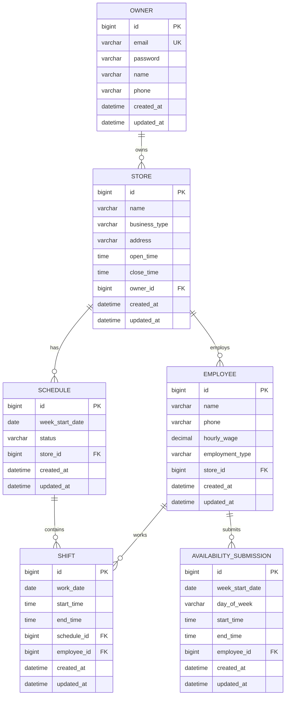
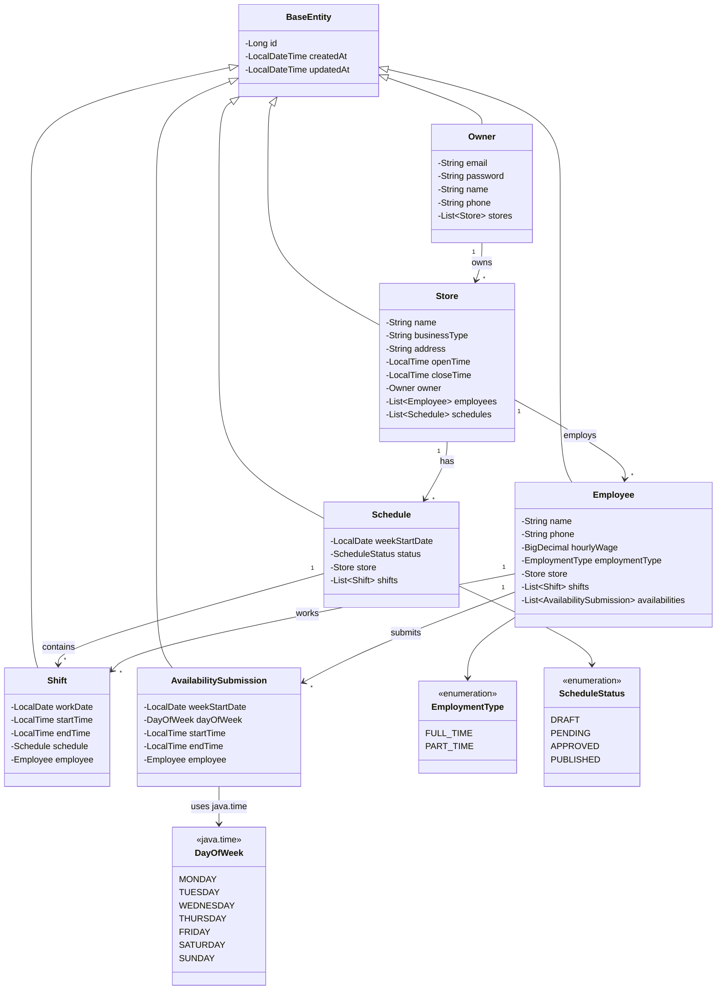

## 1. 목적
핵심 도메인 엔터티를 위한 초기 MySQL 데이터베이스 스키마를 설계하고 구현한다.

## 2. 범위
- `Owner`, `Store`, `Employee`, `Schedule`, `Shift`, `AvailabilitySubmission` 엔터티 정의
- Docker Compose를 통한 MySQL 로컬 개발 환경 구성
- 엔터티 간 관계(OneToMany, ManyToOne) 및 제약조건 설정
- JPA Repository 인터페이스 생성

## 3. 상세 작업

### 3.1 개발 환경 구성
- [ ] Docker Compose로 MySQL 8.x 로컬 환경 구성 (`docker-compose.yml`)
- [ ] `application-local.yml` 프로파일 추가 (MySQL 로컬 연결용)
- [ ] `.env.example` 파일 생성 (환경변수 템플릿)

### 3.2 Owner 엔티티
- [ ] `Owner.java` 엔티티 클래스 생성
- [ ] `OwnerRepository.java` 인터페이스 생성

### 3.3 Store 엔티티
- [ ] `Store.java` 엔티티 클래스 생성
- [ ] `StoreRepository.java` 인터페이스 생성

### 3.4 Employee 엔티티
- [ ] `Employee.java` 엔티티 클래스 생성
- [ ] `EmployeeRepository.java` 인터페이스 생성

### 3.5 Schedule 엔티티
- [ ] `Schedule.java` 엔티티 클래스 생성
- [ ] `ScheduleRepository.java` 인터페이스 생성

### 3.6 Shift 엔티티
- [ ] `Shift.java` 엔티티 클래스 생성
- [ ] `ShiftRepository.java` 인터페이스 생성

### 3.7 AvailabilitySubmission 엔티티
- [ ] `AvailabilitySubmission.java` 엔티티 클래스 생성
- [ ] `AvailabilitySubmissionRepository.java` 인터페이스 생성

### 3.8 Enum 타입 정의
- [ ] `EmploymentType.java` (FULL_TIME, PART_TIME)
- [ ] `ScheduleStatus.java` (DRAFT, PENDING, APPROVED, PUBLISHED)
- ℹ️ `DayOfWeek`는 Java 표준 라이브러리 `java.time.DayOfWeek` 사용 (커스텀 Enum 불필요)

### 3.9 DDL 검증
- [ ] Docker MySQL 기동 후 애플리케이션 실행
- [ ] `ddl-auto: update` 설정으로 테이블 자동 생성 확인
- [ ] 생성된 스키마가 ERD와 일치하는지 검증

## 4. 완료 조건 (Acceptance Criteria)
- [ ] `docker-compose up -d` 명령으로 MySQL이 정상 기동되어야 한다.
- [ ] `./gradlew bootRun --args='--spring.profiles.active=local'`로 앱 실행 시 DB 연결 성공해야 한다.
- [ ] MySQL 스키마에 ERD와 일치하는 6개 테이블이 올바르게 생성되어야 한다.
- [ ] H2 Console 또는 MySQL CLI로 테이블 구조 확인 가능해야 한다.

## 5. 기술 스택
- **Java**: 21 (LTS)
- **Spring Boot**: 3.3.5
- **Database**: MySQL 8.x (InnoDB)
- **ORM**: Spring Data JPA (Hibernate)
- **Container**: Docker / Docker Compose

---

## 6. ERD (Entity Relationship Diagram)

### 6.1 전체 ERD



### 6.2 엔티티 관계 요약

| 관계 | 카디널리티 | 설명 |
|------|-----------|------|
| Owner → Store | 1:N | 한 사장이 여러 매장 소유 가능 |
| Store → Employee | 1:N | 한 매장에 여러 직원 소속 |
| Store → Schedule | 1:N | 한 매장에 여러 주차 스케줄 |
| Schedule → Shift | 1:N | 한 스케줄에 여러 근무 시프트 |
| Employee → Shift | 1:N | 한 직원이 여러 시프트 근무 |
| Employee → AvailabilitySubmission | 1:N | 한 직원이 여러 가용시간 제출 |

---

## 7. 엔티티 상세 스키마

### 7.1 Owner (사장/운영자)

| 컬럼명 | 타입 | 제약조건 | 설명 |
|--------|------|----------|------|
| `id` | `BIGINT` | `PK, AUTO_INCREMENT` | 기본키 |
| `email` | `VARCHAR(255)` | `UNIQUE, NOT NULL` | 로그인 이메일 |
| `password` | `VARCHAR(255)` | `NOT NULL` | 암호화된 비밀번호 |
| `name` | `VARCHAR(100)` | `NOT NULL` | 사장님 이름 |
| `phone` | `VARCHAR(20)` | | 연락처 |
| `created_at` | `DATETIME` | `NOT NULL` | 생성일시 |
| `updated_at` | `DATETIME` | `NOT NULL` | 수정일시 |

### 7.2 Store (매장)

| 컬럼명 | 타입 | 제약조건 | 설명 |
|--------|------|----------|------|
| `id` | `BIGINT` | `PK, AUTO_INCREMENT` | 기본키 |
| `name` | `VARCHAR(100)` | `NOT NULL` | 매장명 |
| `business_type` | `VARCHAR(50)` | | 업종 (베이커리, 카페 등) |
| `address` | `VARCHAR(255)` | | 매장 주소 |
| `open_time` | `TIME` | | 영업 시작 시간 |
| `close_time` | `TIME` | | 영업 종료 시간 |
| `owner_id` | `BIGINT` | `FK → Owner, NOT NULL` | 소유자 |
| `created_at` | `DATETIME` | `NOT NULL` | 생성일시 |
| `updated_at` | `DATETIME` | `NOT NULL` | 수정일시 |

### 7.3 Employee (직원)

| 컬럼명 | 타입 | 제약조건 | 설명 |
|--------|------|----------|------|
| `id` | `BIGINT` | `PK, AUTO_INCREMENT` | 기본키 |
| `name` | `VARCHAR(100)` | `NOT NULL` | 직원 이름 |
| `phone` | `VARCHAR(20)` | | 연락처 |
| `hourly_wage` | `DECIMAL(10,2)` | | 시급 |
| `employment_type` | `VARCHAR(20)` | `NOT NULL` | 고용형태 (FULL_TIME/PART_TIME) |
| `store_id` | `BIGINT` | `FK → Store, NOT NULL` | 소속 매장 |
| `created_at` | `DATETIME` | `NOT NULL` | 생성일시 |
| `updated_at` | `DATETIME` | `NOT NULL` | 수정일시 |

### 7.4 Schedule (스케줄)

| 컬럼명 | 타입 | 제약조건 | 설명 |
|--------|------|----------|------|
| `id` | `BIGINT` | `PK, AUTO_INCREMENT` | 기본키 |
| `week_start_date` | `DATE` | `NOT NULL` | 주 시작일 (월요일) |
| `status` | `VARCHAR(20)` | `NOT NULL` | 상태 (DRAFT/PENDING/APPROVED/PUBLISHED) |
| `store_id` | `BIGINT` | `FK → Store, NOT NULL` | 매장 |
| `created_at` | `DATETIME` | `NOT NULL` | 생성일시 |
| `updated_at` | `DATETIME` | `NOT NULL` | 수정일시 |

**복합 유니크 제약**: `(store_id, week_start_date)` - 한 매장에 같은 주의 스케줄은 하나만

### 7.5 Shift (근무 시프트)

| 컬럼명 | 타입 | 제약조건 | 설명 |
|--------|------|----------|------|
| `id` | `BIGINT` | `PK, AUTO_INCREMENT` | 기본키 |
| `work_date` | `DATE` | `NOT NULL` | 근무일 |
| `start_time` | `TIME` | `NOT NULL` | 시작 시간 |
| `end_time` | `TIME` | `NOT NULL` | 종료 시간 |
| `schedule_id` | `BIGINT` | `FK → Schedule, NOT NULL` | 소속 스케줄 |
| `employee_id` | `BIGINT` | `FK → Employee, NOT NULL` | 근무 직원 |
| `created_at` | `DATETIME` | `NOT NULL` | 생성일시 |
| `updated_at` | `DATETIME` | `NOT NULL` | 수정일시 |

### 7.6 AvailabilitySubmission (가용시간 제출)

| 컬럼명 | 타입 | 제약조건 | 설명 |
|--------|------|----------|------|
| `id` | `BIGINT` | `PK, AUTO_INCREMENT` | 기본키 |
| `week_start_date` | `DATE` | `NOT NULL` | 주 시작일 |
| `day_of_week` | `VARCHAR(10)` | `NOT NULL` | 요일 (MON~SUN) |
| `start_time` | `TIME` | `NOT NULL` | 가용 시작 시간 |
| `end_time` | `TIME` | `NOT NULL` | 가용 종료 시간 |
| `employee_id` | `BIGINT` | `FK → Employee, NOT NULL` | 직원 |
| `created_at` | `DATETIME` | `NOT NULL` | 생성일시 |
| `updated_at` | `DATETIME` | `NOT NULL` | 수정일시 |

---

## 8. CLD (Class Diagram)

### 8.1 엔티티 클래스 다이어그램



---

## 9. ORM 예제 코드

### 9.1 Owner 엔티티

```java
package vibe.scon.scon_backend.entity;

import jakarta.persistence.*;
import lombok.AccessLevel;
import lombok.Builder;
import lombok.Getter;
import lombok.NoArgsConstructor;

import java.util.ArrayList;
import java.util.List;

/**
 * 매장 사장/운영자 엔티티.
 * 시스템의 주요 사용자로 매장을 소유하고 관리한다.
 */
@Entity
@Table(name = "owners")
@Getter
@NoArgsConstructor(access = AccessLevel.PROTECTED)
public class Owner extends BaseEntity {

    @Column(nullable = false, unique = true)
    private String email;

    @Column(nullable = false)
    private String password;

    @Column(nullable = false, length = 100)
    private String name;

    @Column(length = 20)
    private String phone;

    @OneToMany(mappedBy = "owner", cascade = CascadeType.ALL, orphanRemoval = true)
    private List<Store> stores = new ArrayList<>();

    @Builder
    public Owner(String email, String password, String name, String phone) {
        this.email = email;
        this.password = password;
        this.name = name;
        this.phone = phone;
    }

    // 연관관계 편의 메서드
    public void addStore(Store store) {
        stores.add(store);
        store.setOwner(this);
    }
}
```

### 9.2 Store 엔티티

```java
package vibe.scon.scon_backend.entity;

import jakarta.persistence.*;
import lombok.AccessLevel;
import lombok.Builder;
import lombok.Getter;
import lombok.NoArgsConstructor;
import lombok.Setter;

import java.time.LocalTime;
import java.util.ArrayList;
import java.util.List;

/**
 * 매장 엔티티.
 * 사장님이 운영하는 개별 매장 정보를 저장한다.
 */
@Entity
@Table(name = "stores")
@Getter
@NoArgsConstructor(access = AccessLevel.PROTECTED)
public class Store extends BaseEntity {

    @Column(nullable = false, length = 100)
    private String name;

    @Column(name = "business_type", length = 50)
    private String businessType;

    @Column(length = 255)
    private String address;

    @Column(name = "open_time")
    private LocalTime openTime;

    @Column(name = "close_time")
    private LocalTime closeTime;

    @Setter
    @ManyToOne(fetch = FetchType.LAZY)
    @JoinColumn(name = "owner_id", nullable = false)
    private Owner owner;

    @OneToMany(mappedBy = "store", cascade = CascadeType.ALL, orphanRemoval = true)
    private List<Employee> employees = new ArrayList<>();

    @OneToMany(mappedBy = "store", cascade = CascadeType.ALL, orphanRemoval = true)
    private List<Schedule> schedules = new ArrayList<>();

    @Builder
    public Store(String name, String businessType, String address, 
                 LocalTime openTime, LocalTime closeTime, Owner owner) {
        this.name = name;
        this.businessType = businessType;
        this.address = address;
        this.openTime = openTime;
        this.closeTime = closeTime;
        this.owner = owner;
    }

    // 연관관계 편의 메서드
    public void addEmployee(Employee employee) {
        employees.add(employee);
        employee.setStore(this);
    }
}
```

### 9.3 Employee 엔티티

```java
package vibe.scon.scon_backend.entity;

import jakarta.persistence.*;
import lombok.AccessLevel;
import lombok.Builder;
import lombok.Getter;
import lombok.NoArgsConstructor;
import lombok.Setter;
import vibe.scon.scon_backend.entity.enums.EmploymentType;

import java.math.BigDecimal;
import java.util.ArrayList;
import java.util.List;

/**
 * 직원 엔티티.
 * 매장에 소속된 정규직/비정규직 직원 정보를 저장한다.
 */
@Entity
@Table(name = "employees")
@Getter
@NoArgsConstructor(access = AccessLevel.PROTECTED)
public class Employee extends BaseEntity {

    @Column(nullable = false, length = 100)
    private String name;

    @Column(length = 20)
    private String phone;

    @Column(name = "hourly_wage", precision = 10, scale = 2)
    private BigDecimal hourlyWage;

    @Enumerated(EnumType.STRING)
    @Column(name = "employment_type", nullable = false, length = 20)
    private EmploymentType employmentType;

    @Setter
    @ManyToOne(fetch = FetchType.LAZY)
    @JoinColumn(name = "store_id", nullable = false)
    private Store store;

    @OneToMany(mappedBy = "employee", cascade = CascadeType.ALL, orphanRemoval = true)
    private List<Shift> shifts = new ArrayList<>();

    @OneToMany(mappedBy = "employee", cascade = CascadeType.ALL, orphanRemoval = true)
    private List<AvailabilitySubmission> availabilities = new ArrayList<>();

    @Builder
    public Employee(String name, String phone, BigDecimal hourlyWage,
                    EmploymentType employmentType, Store store) {
        this.name = name;
        this.phone = phone;
        this.hourlyWage = hourlyWage;
        this.employmentType = employmentType;
        this.store = store;
    }
}
```

### 9.4 Enum 타입

```java
// EmploymentType.java
package vibe.scon.scon_backend.entity.enums;

/**
 * 직원 고용 형태.
 */
public enum EmploymentType {
    FULL_TIME,  // 정규직
    PART_TIME   // 비정규직/아르바이트
}

// ScheduleStatus.java
package vibe.scon.scon_backend.entity.enums;

/**
 * 스케줄 상태.
 */
public enum ScheduleStatus {
    DRAFT,      // 초안 (작성 중)
    PENDING,    // 검토 대기
    APPROVED,   // 승인됨
    PUBLISHED   // 공개됨 (직원에게 전달)
}
```

### 9.5 Repository 인터페이스

```java
// OwnerRepository.java
package vibe.scon.scon_backend.repository;

import org.springframework.data.jpa.repository.JpaRepository;
import vibe.scon.scon_backend.entity.Owner;

import java.util.Optional;

public interface OwnerRepository extends JpaRepository<Owner, Long> {
    Optional<Owner> findByEmail(String email);
    boolean existsByEmail(String email);
}

// StoreRepository.java
package vibe.scon.scon_backend.repository;

import org.springframework.data.jpa.repository.JpaRepository;
import vibe.scon.scon_backend.entity.Store;

import java.util.List;

public interface StoreRepository extends JpaRepository<Store, Long> {
    List<Store> findByOwnerId(Long ownerId);
}

// EmployeeRepository.java
package vibe.scon.scon_backend.repository;

import org.springframework.data.jpa.repository.JpaRepository;
import vibe.scon.scon_backend.entity.Employee;

import java.util.List;

public interface EmployeeRepository extends JpaRepository<Employee, Long> {
    List<Employee> findByStoreId(Long storeId);
}
```

---

## 10. Docker Compose 설정

### 10.1 docker-compose.yml

> ⚠️ `version` 키는 Docker Compose V2에서 deprecated되어 제거되었습니다.

```yaml
services:
  mysql:
    image: mysql:8.0
    container_name: scon-mysql
    env_file:
      - .env
    environment:
      MYSQL_ROOT_PASSWORD: ${MYSQL_ROOT_PASSWORD:-root}
      MYSQL_DATABASE: ${MYSQL_DATABASE:-scon_db}
      MYSQL_USER: ${MYSQL_USER:-scon}
      MYSQL_PASSWORD: ${MYSQL_PASSWORD:-scon1234}
    ports:
      - "3306:3306"
    volumes:
      - mysql-data:/var/lib/mysql
    command:
      - --character-set-server=utf8mb4
      - --collation-server=utf8mb4_unicode_ci
    healthcheck:
      test: ["CMD", "mysqladmin", "ping", "-h", "localhost"]
      interval: 10s
      timeout: 5s
      retries: 5

volumes:
  mysql-data:
```

### 10.2 application-local.yml

> ⚠️ **보안 주의**: 민감한 정보(비밀번호 등)는 환경변수로 관리합니다. 하드코딩 금지!

```yaml
# MySQL Local Development Configuration
# 민감한 정보는 환경변수 또는 .env 파일에서 로드
spring:
  datasource:
    url: jdbc:mysql://${MYSQL_HOST:localhost}:${MYSQL_PORT:3306}/${MYSQL_DATABASE:scon_db}?useSSL=false&serverTimezone=Asia/Seoul&characterEncoding=UTF-8&allowPublicKeyRetrieval=true
    driver-class-name: com.mysql.cj.jdbc.Driver
    username: ${MYSQL_USER:scon}
    password: ${MYSQL_PASSWORD}

  jpa:
    hibernate:
      ddl-auto: update
    show-sql: true
    database-platform: org.hibernate.dialect.MySQLDialect
    properties:
      hibernate:
        format_sql: true

logging:
  level:
    org.hibernate.SQL: DEBUG
```

### 10.3 .env.example

> `.env.example`은 버전 관리에 포함하고, 실제 `.env` 파일은 `.gitignore`에 추가합니다.

```env
# =============================================================================
# SCON Backend - Local Development Environment Variables
# =============================================================================
# 이 파일을 복사하여 .env 파일을 생성하세요: cp .env.example .env
# 실제 .env 파일은 절대 Git에 커밋하지 마세요!

# MySQL Database Configuration
MYSQL_HOST=localhost
MYSQL_PORT=3306
MYSQL_DATABASE=scon_db
MYSQL_USER=scon
MYSQL_PASSWORD=your_secure_password_here
MYSQL_ROOT_PASSWORD=your_root_password_here
```

---

## 11. 구현 순서 가이드

| 순서 | 계층 | 작업 내용 |
|------|------|----------|
| 1 | **Infrastructure** | Docker Compose, .env.example, application-local.yml 설정 |
| 2 | **Enum** | EmploymentType, ScheduleStatus 정의 (`java.time.DayOfWeek` 표준 사용) |
| 3 | **Entity** | Owner → Store → Employee → Schedule → Shift → AvailabilitySubmission 순서로 구현 |
| 4 | **Repository** | 각 엔티티에 대한 JpaRepository 인터페이스 생성 |
| 5 | **Validation** | Docker MySQL 기동 후 DDL 자동 생성 검증 |
| 6 | **Test** | Repository 단위 테스트 (선택) |

---

## 12. 참고 사항

### 12.1 Issue-001에서 완료된 항목 (재작업 불필요)
- ✅ `BaseEntity` (id, createdAt, updatedAt)
- ✅ `JpaConfig` (@EnableJpaAuditing)
- ✅ `application-dev.yml` (H2 개발 환경)
- ✅ `application-prod.yml` (MySQL 운영 환경)
- ✅ `build.gradle` MySQL/JPA 의존성

### 12.2 향후 확장 (이번 이슈 범위 외)
- ComplianceRule (노동법 규칙) 엔티티 - Issue-006
- AuditLog (변경 이력) 엔티티 - 별도 이슈
- 인증/인가 (Spring Security) - 별도 이슈
